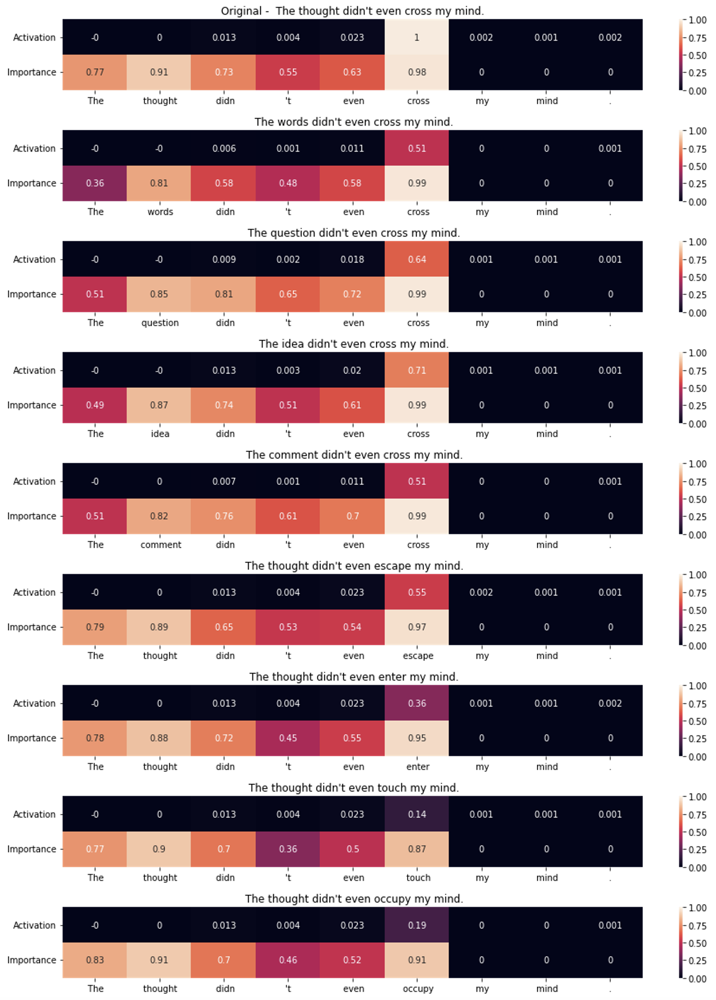

# ActivationExplorer

Tools for exploring Transformer neuron behaviour, including input pruning and diversification, measuring token importance, and visualising the results.

See `Demo.ipynb` for a walkthrough of the method, and run it in Colab to try it yourself!

An initial version of this project won 1st Place at the [Apart Research Interpretability Hackathon](https://itch.io/jam/interpretability/results).

## Description

Given a dataset example that is highly activating to a given neuron, the algorithm will prune it to the shortest string that is still highly activating, then generate new variations of that pruned prompt by substituting tokens using BERT. It can measure token importance by masking tokens and measuring the change in activation, and visualize token importance and relative neuron activation for a prompt.

For example, given an input like text #0 for [this neuron](https://lexoscope.io/solu-8l-pile/3/1.html), the algorithm produces and visualizes a more diverse set of prompts, to give better insight into neuron behavior.

